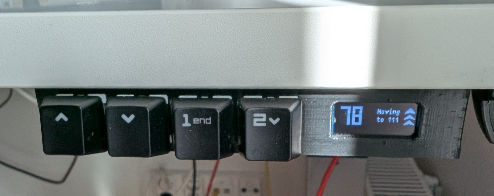
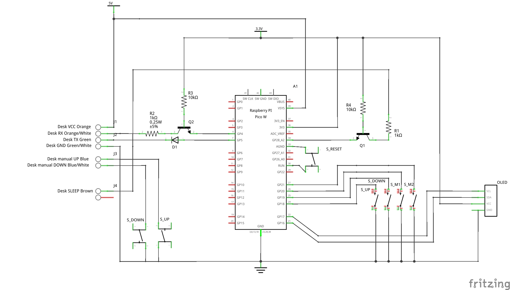
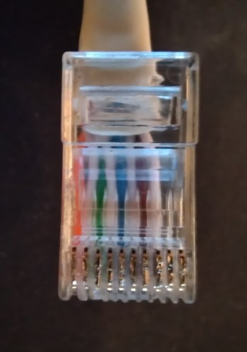

Timotion / Martela Desk Controller
==================================

RP2040 / Raspberry Pi Pico based custom controller for Timotion / Adjustme standing desks (sold as Martela desks in Finland).

### Supported desks

The only one I've tried is "Martela Pinta EQ". This desk uses the **Adjustme TC15** control box which is actually just **Timotion TC15**.

Other control boxes are probably not directly compatible.

### Features
- Height display
- Two memory slots for desk height
- Automatic drive to target height
- Trigger TC15's built-in calibration (hold both Up & Down keys)

### Hardware

- Raspberry Pi Pico or any other RP2040 based board
- SSD1306 128x32 OLED display
- 4x buttons or swiches (I used mechanical keyboard switches)
- Some resistors, NPN transistors, diodes (see schematic)
- RJ50/RJ48 connector + CAT5 or CAT6 for connecting to the control box
- 3D printed enclosure

#### Schematic

#### Connector

